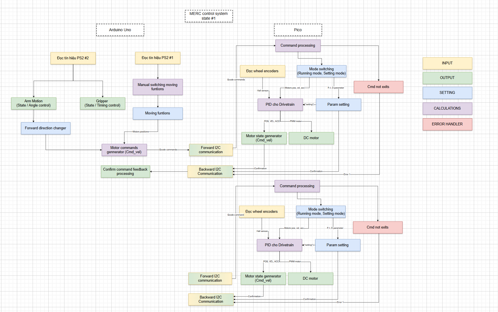
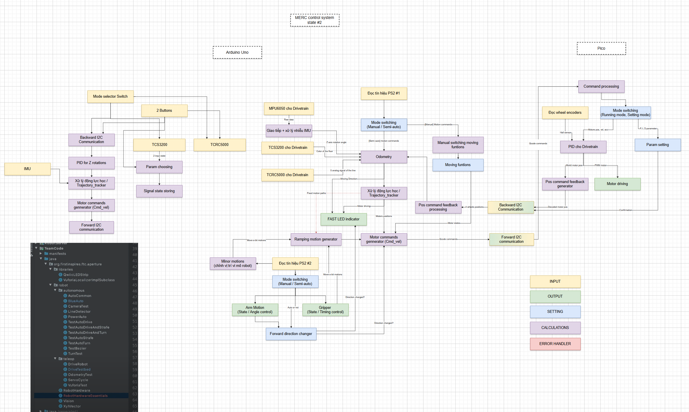

# Introduction
LCS25 firmware is v1.1 for microcontroller part of Object LCS25 - algorithm testing robot. 
The main purpose of this project is to develop a bridging program receiving control from high level commands from ROS/ROS2 and control robot's kinematics.
PS: This repo is the next version from [2nd prize robot](https://www.facebook.com/share/p/1Evmse11Xx/) that competed in [MERC 2025](https://fme.hcmut.edu.vn/phat-dong-cuoc-thi-robot-toan-nang-merc-2025-quoc-su-hung-ca.html) (Mechanical Engineering Robot Contest 2025) - "QUỐC SỬ DÙNG CA" by team [LC Sign](https://www.facebook.com/share/p/1Evmse11Xx/).

# Structure
The original project's structures:
## CS state #1:

## CS state #2:

